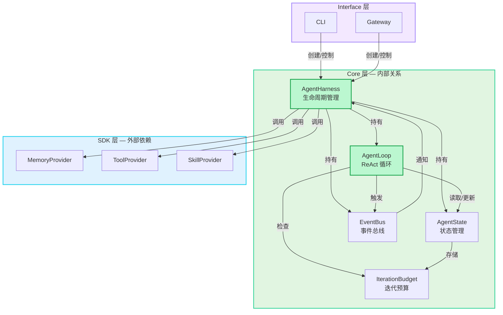
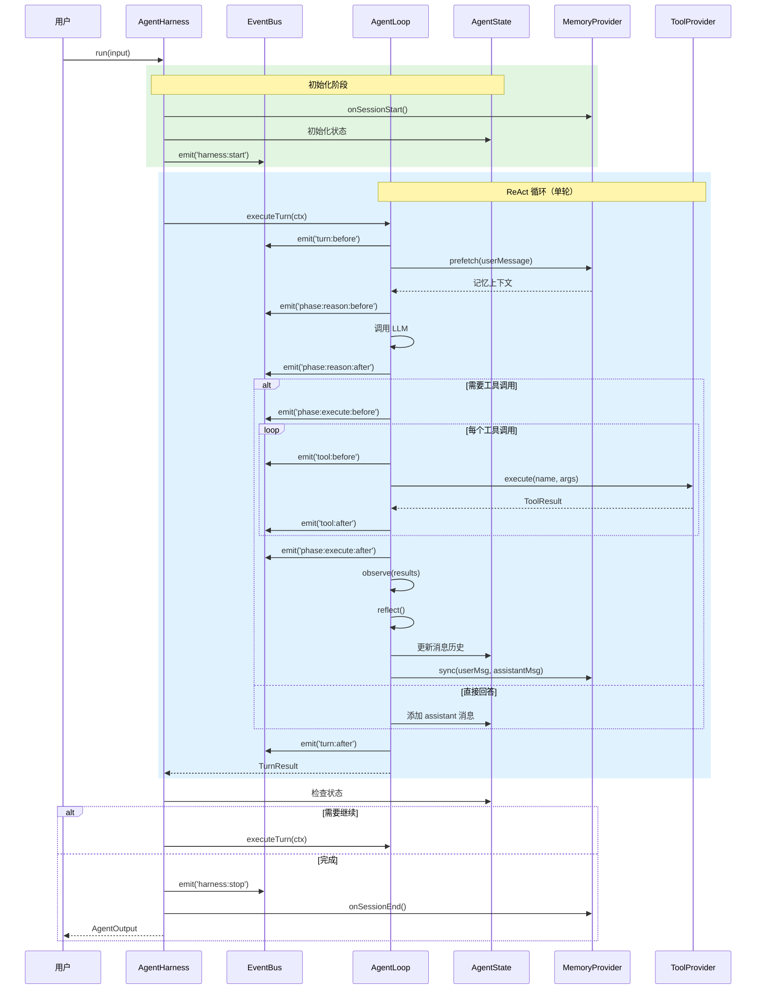
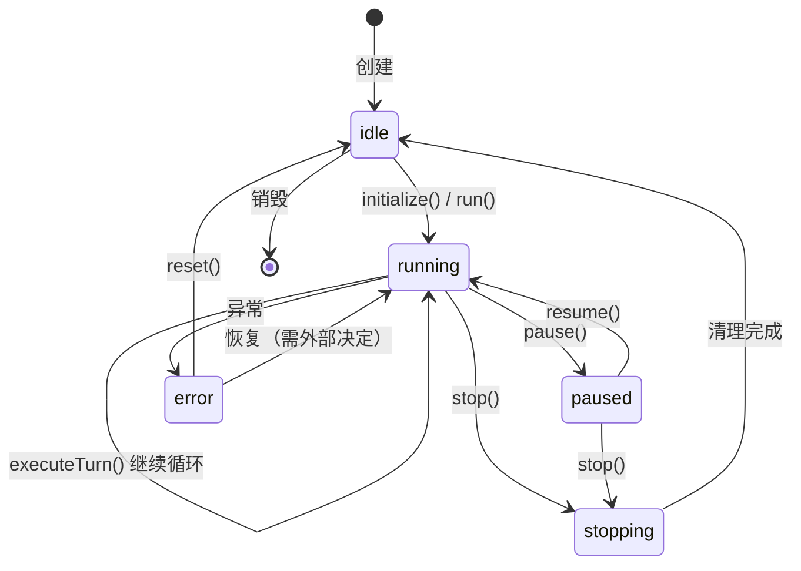

# Core 层详细设计

> 状态：📦 历史参考（2026-06-10 初稿，2026-06-30 标注）
>
> **本文档描述早期设计阶段的概念模型（AgentHarness、ModelClient 等）。实际实现已偏离此设计。**
>
> 当前实现文档见 `docs/architecture.md`（Core 层实际架构）和 `docs/module-reference.md`（模块级别参考）。
> 重构方向见 `docs/target-architecture.md`。
>
> 下文保留原始设计分析（Q1-Q4 设计问题讨论）作为决策历史，但代码接口示例不代表当前实现。

---

## 关键架构问题分析

### Q1: AgentHarness 的命名与职责

**为什么叫 Harness？**

Harness 的核心概念是 **"确定性控制层包裹概率性 LLM"**。在软件工程中，Harness 指管理执行环境的基础设施——它不负责"做什么"（那是 Agent/LLM 的事），而是负责"怎么运行"。

**AgentHarness vs AgentLoop 的职责分离：**

| 维度 | AgentHarness | AgentLoop |
|------|-------------|-----------|
| **管理范围** | 整个会话（多轮） | 单轮执行 |
| **核心职责** | 生命周期、状态持久化、外部协调 | 推理→计划→执行→观察 |
| **持久化** | 保存/恢复检查点 | 无 |
| **与 SDK 交互** | 初始化 provider、会话开始/结束 | 每轮调用 provider |
| **人工介入** | 支持 pause/resume/stop | 无 |
| **类比** | 操作系统进程管理器 | CPU 执行单元 |

**AgentHarness 在 Loop 基础上增加了：**

1. **生命周期管理** — 创建、初始化、运行、暂停、恢复、停止、重置
2. **状态持久化** — 会话级状态保存到 SQLite，支持跨进程恢复
3. **Provider 协调** — 初始化 Memory/Tool/Skill provider，管理它们的连接
4. **事件系统** — 为插件提供介入点
5. **错误隔离** — Loop 出错不会崩溃整个进程，Harness 捕获并进入 error 状态

```
AgentHarness:         AgentLoop:
├─ initialize()       ├─ executeTurn() ──→ prepare()
├─ run()              │                  ├─ reason()
├─ pause()            │                  ├─ plan()
├─ resume()           │                  ├─ execute()
├─ stop()             │                  ├─ observe()
├─ reset()            │                  └─ reflect()
└─ on() 事件订阅       └─ （一轮结束，返回结果）
```

### Q2: Loop 模式对比 — ReAct 之外还有什么？

**主流 Agent 循环模式：**

| 模式 | 核心思想 | 代表框架 | 适用场景 |
|------|---------|---------|---------|
| **ReAct** | 推理→行动→观察，交替进行 | Hermes、OpenClaw、大多数框架 | 通用场景，工具调用 |
| **Plan-and-Solve** | 先制定完整计划，再执行 | Plan-and-Execute (LangChain) | 复杂多步任务 |
| **Reflexion** | 执行→自我批评→重试 | Reflexion 论文 | 需要自我修正的任务 |
| **LLMCompiler** | 并行执行独立工具调用 | LLMCompiler (LangChain) | 工具间无依赖，追求效率 |
| **ReWOO** | 解耦推理和观察，减少 token | ReWOO 论文 | 长流程、token 敏感 |

**Hermes 的做法：**

```
ReAct + Subagent 委派

单 Agent 循环内：
  Reason → Plan → Execute → Observe → Reflect

复杂任务时：
  delegate_task() → 启动独立子 Agent → 等待结果 → 合并到父上下文
```

- 主循环是标准 ReAct
- `delegate_task` 是实现并行/委派的关键扩展
- 子 Agent 有独立的上下文和预算

**OpenClaw 的做法：**

```
ReAct + Subagent Registry

主循环：
  Reason → Plan → Execute → Observe

子 Agent：
  subagent-spawn → 独立运行 → 结果回调 → 父 Agent 继续
```

- 同样是 ReAct 基础
- 子 Agent 通过 registry 管理，支持持久化
- 子 Agent 可以是"嵌入式"（同进程）或"隔离式"（cron/isolated-agent）

**优劣对比：**

| 维度 | Hermes | OpenClaw |
|------|--------|----------|
| 循环模式 | ReAct + 委派 | ReAct + 子 Agent |
| 并行能力 | ThreadPoolExecutor | 嵌入式 + 隔离式 |
| 子 Agent 生命周期 | 临时，任务结束销毁 | 可持久化，registry 管理 |
| 上下文隔离 | 独立上下文 | 可选隔离级别 |
| 复杂度 | 较简单 | 较复杂（registry、持久化） |

**我们的选择：**

第一阶段只用 **标准 ReAct**，但 Loop 设计为可扩展：

```typescript
interface LoopStrategy {
  async execute(ctx: TurnContext): Promise<TurnResult>;
}

// 默认实现
class ReactLoop implements LoopStrategy { ... }

// 未来可扩展
class PlanAndSolveLoop implements LoopStrategy { ... }
```

### Q3: LLM 调用是否使用 vercel/ai 等框架？

**候选方案对比：**

| 方案 | 优点 | 缺点 | 结论 |
|------|------|------|------|
| **vercel/ai** | 流式输出优秀、前端友好 | 无工具循环管理、抽象层太薄 | ❌ 不适合 |
| **LangChain** | 生态丰富、集成多 | 过度抽象、代码臃肿、难以调试 | ❌ 不适合 |
| **直接使用 SDK** | 完全控制、无隐藏逻辑 | 需要自己处理多 provider | ✅ 推荐 |
| **封装统一接口** | 控制 + 简洁 | 需要维护封装层 | ✅ 我们的方案 |

**我们的设计：**

```typescript
// src/core/model-client.ts
// 轻量级封装，不引入外部框架

interface ModelClient {
  chat(messages: Message[], options: ChatOptions): Promise<ChatResponse>;
  stream(messages: Message[], options: ChatOptions): AsyncIterable<StreamChunk>;
}

// 内部根据 provider 路由到对应 SDK
class UnifiedModelClient implements ModelClient {
  async chat(messages, options) {
    // 根据 config.provider 选择：
    // - OpenAI SDK
    // - Anthropic SDK
    // - 自定义 fetch（OpenRouter）
  }
}
```

**不引入 vercel/ai 的原因：**

1. 我们需要完全控制工具调用循环（`executeTurn`），vercel/ai 没有这个概念
2. 我们需要自定义事件钩子系统，外部框架会干扰
3. 工具调用的错误处理、重试、预算控制都需要定制
4. 流式输出我们自己用 AsyncIterable 实现，不复杂

### Q4: AgentEvent 的设计考虑

**为什么需要事件系统？**

如果没有事件系统，Core 和插件的耦合会是这样：

```typescript
// ❌ 坏设计：Core 直接调用插件
class AgentLoop {
  async executeTurn() {
    // Core 里硬编码了记忆注入逻辑
    const memory = await this.memoryProvider.prefetch(msg);
    
    // Core 里硬编码了技能提醒
    if (turnNumber % 15 === 0) {
      prompt += 'Consider creating a skill...';
    }
    
    // Core 里硬编码了日志
    logger.info('Turn started');
  }
}
```

问题：
- Core 膨胀，每加一个功能都要改 Core
- 插件无法在不修改 Core 的情况下扩展行为
- 测试困难，所有逻辑混在一起

**事件系统的解耦价值：**

```typescript
// ✅ 好设计：Core 只触发事件，插件订阅
class AgentLoop {
  async executeTurn() {
    await this.events.emit('turn:before', ctx);  // 记忆插件注入上下文
    
    // ... 执行循环 ...
    
    await this.events.emit('turn:after', ctx);   // 技能插件检查是否创建技能
  }
}

// 插件独立注册
memoryPlugin.on('turn:before', injectMemory);
skillPlugin.on('turn:after', nudgeSkillCreation);
loggerPlugin.on('turn:after', logTurn);
```

**AgentEvent 的具体场景：**

| 事件 | 订阅者 | 用途 |
|------|--------|------|
| `turn:before` | MemoryProvider | 注入相关记忆到 prompt |
| `phase:reason:before` | BudgetChecker | 检查预算，超预算则阻止 |
| `phase:execute:before` | SecurityPlugin | 检查危险命令 |
| `tool:after` | Logger | 记录工具调用轨迹 |
| `turn:after` | SkillProvider | 每 N 轮提醒创建技能 |
| `compress:before` | MemoryProvider | 保护重要消息不被压缩 |
| `harness:pause` | StateManager | 保存检查点到 SQLite |

**事件系统的核心价值：**

1. **解耦** — Core 不知道插件存在
2. **可观测** — 所有行为通过事件可追踪
3. **可扩展** — 新功能通过订阅事件实现，不改 Core
4. **可测试** — 可以 mock 事件来测试插件

---

## 模块关系图



---

## 数据流向图



---

## 状态机图



---

## 1. AgentHarness — 生命周期管理

```typescript
// src/core/harness.ts

type AgentStatus = 'idle' | 'running' | 'paused' | 'stopping' | 'error';

interface AgentHarnessConfig {
  name: string;
  maxTurns: number;
  model: ModelConfig;
  providers: {
    memory: MemoryProvider;
    tool: ToolProvider;
    skill?: SkillProvider;
  };
}

class AgentHarness {
  private config: AgentHarnessConfig;
  private loop: AgentLoop;
  private state: AgentState;
  private events: EventBus;
  
  // 当前状态
  get status(): AgentStatus;
  
  // 生命周期方法
  constructor(config: AgentHarnessConfig);
  
  async initialize(): Promise<void>;     // 初始化：加载记忆、注册钩子
  async run(input: UserInput): Promise<AgentOutput>;  // 运行完整对话
  async pause(): Promise<void>;           // 暂停（可恢复）
  async resume(): Promise<void>;          // 恢复
  async stop(): Promise<void>;            // 停止（不可逆）
  async reset(): Promise<void>;           // 重置会话
  
  // 事件订阅（供插件使用）
  on(event: AgentEvent, handler: EventHandler): () => void;
  once(event: AgentEvent, handler: EventHandler): void;
}
```

**关键设计决策：**

| 决策 | 选择 | 理由 |
|------|------|------|
| 初始化方式 | 显式 `initialize()` | 避免构造函数中做异步操作 |
| 暂停/恢复 | 状态机控制 | 支持人工介入和长时间任务 |
| 重置 | 保留记忆，清空对话 | 与 `/new` 命令行为一致 |
| 错误处理 | 状态进入 `error`，不自动恢复 | 让上层决定重试或报告 |

---

## 2. AgentLoop — ReAct 循环

```typescript
// src/core/loop.ts

// Loop 策略接口（可扩展）
interface LoopStrategy {
  async execute(ctx: TurnContext): Promise<TurnResult>;
}

type TurnPhase = 
  | 'prepare'      // 准备：注入记忆、技能上下文
  | 'reason'       // 推理：调用 LLM
  | 'plan'         // 计划：解析工具调用意图
  | 'execute'      // 执行：调用工具
  | 'observe'      // 观察：收集工具结果
  | 'reflect';     // 反思：决定是否继续

interface TurnContext {
  input: UserInput;
  turnNumber: number;
  conversation: Message[];
  systemPrompt: string;
  availableTools: ToolDefinition[];
}

interface TurnResult {
  output: AgentOutput;
  phase: TurnPhase;
  toolCalls: ToolCallRecord[];
  completed: boolean;      // true = 本轮有最终答案
  shouldContinue: boolean; // true = 需要继续下一轮
}

// 默认实现：标准 ReAct
class ReactLoop implements LoopStrategy {
  private harness: AgentHarness;
  private budget: IterationBudget;
  private modelClient: ModelClient;  // 内部轻量封装，不依赖外部框架
  
  async execute(ctx: TurnContext): Promise<TurnResult>;
  
  private async prepare(ctx: TurnContext): Promise<void>;
  private async reason(ctx: TurnContext): Promise<LLMResponse>;
  private async plan(response: LLMResponse): Promise<ToolCall[] | string>;
  private async execute(calls: ToolCall[]): Promise<ToolResult[]>;
  private async observe(results: ToolResult[]): Promise<Observation>;
  private async reflect(obs: Observation): Promise<Reflection>;
}

// 未来可扩展的其他策略
// class PlanAndSolveLoop implements LoopStrategy { ... }
```

**循环流程详细状态机：**

```
┌─────────┐    ┌─────────┐    ┌─────────┐    ┌─────────┐
│ prepare │───→│ reason  │───→│  plan   │───→│ execute │
│         │    │ (LLM)   │    │(parse)  │    │(tools)  │
└─────────┘    └─────────┘    └────┬────┘    └────┬────┘
                                   │              │
                              无工具调用        有工具调用
                                   │              │
                                   └────────┐     │
                                            ↓     │
                                       ┌────────┐ │
                                       │observe │←┘
                                       │        │
                                       └────┬───┘
                                            │
                                       ┌────┴───┐
                                       │reflect │──→ 继续？──→ 回到 reason
                                       │        │    完成？──→ 返回结果
                                       └────────┘
```

---

## 3. AgentState — 状态管理

```typescript
// src/core/state.ts

interface Message {
  role: 'system' | 'user' | 'assistant' | 'tool';
  content: string;
  toolCalls?: ToolCall[];
  toolCallId?: string;
  timestamp: Date;
}

interface ToolCallRecord {
  id: string;
  name: string;
  arguments: Record<string, unknown>;
  result?: ToolResult;
  error?: string;
  durationMs: number;
  timestamp: Date;
}

type AgentStatus = 'idle' | 'running' | 'paused' | 'stopping' | 'error';

class AgentState {
  // 会话标识
  readonly sessionId: string;
  
  // 消息历史（Working Memory 的核心）
  conversation: Message[];
  
  // 当前轮次
  currentTurn: number;
  
  // 迭代预算
  budget: IterationBudget;
  
  // 工具调用记录（跨轮次）
  toolCalls: ToolCallRecord[];
  
  // 运行状态
  status: AgentStatus;
  
  // 暂停时的检查点
  private checkpoint?: StateCheckpoint;
  
  // 方法
  addMessage(msg: Message): void;
  createCheckpoint(): StateCheckpoint;
  restoreCheckpoint(cp: StateCheckpoint): void;
  canContinue(): boolean;  // 检查预算和状态
}
```

---

## 4. EventBus — 事件系统

```typescript
// src/core/events.ts

type AgentEvent =
  // 生命周期事件
  | 'harness:init' | 'harness:start' | 'harness:pause' 
  | 'harness:resume' | 'harness:stop' | 'harness:error'
  // 轮次事件
  | 'turn:before' | 'turn:after'
  // 阶段事件
  | 'phase:prepare' | 'phase:reason:before' | 'phase:reason:after'
  | 'phase:plan' | 'phase:execute:before' | 'phase:execute:after'
  | 'phase:observe' | 'phase:reflect'
  // 工具事件
  | 'tool:before' | 'tool:after' | 'tool:error'
  // 压缩事件
  | 'compress:before' | 'compress:after';

interface EventContext {
  harness: AgentHarness;
  state: AgentState;
  turn?: TurnContext;
  turnResult?: TurnResult;
  toolCall?: ToolCallRecord;
}

type EventHandler = (ctx: EventContext) => Promise<void> | void;

class EventBus {
  on(event: AgentEvent, handler: EventHandler, priority?: number): () => void;
  emit(event: AgentEvent, ctx: EventContext): Promise<void>;
}
```

**优先级设计：**

| 优先级 | 用途 | 示例 |
|--------|------|------|
| 100 | 系统级 | 预算检查、安全检查 |
| 50 | 默认 | 记忆注入、日志记录 |
| 10 | 用户级 | 自定义钩子 |

---

## 5. IterationBudget — 迭代预算

```typescript
// src/core/budget.ts

interface BudgetConfig {
  maxTurns: number;                    // 默认 60
  maxConsecutiveErrors: number;        // 默认 3
  maxSameToolFailures: number;         // 默认 5
  maxIdleTimeMs?: number;              // 可选：空闲超时
}

class IterationBudget {
  private config: BudgetConfig;
  
  // 计数器
  turnCount: number;
  consecutiveErrors: number;
  sameToolFailures: Map<string, number>;  // toolName -> count
  
  // 检查
  hasBudget(): boolean;
  checkTurn(): boolean;
  recordError(toolName?: string): void;
  recordSuccess(toolName?: string): void;
  
  // 获取状态报告
  getStatus(): BudgetStatus;
}

interface BudgetStatus {
  turnsRemaining: number;
  consecutiveErrors: number;
  atRisk: boolean;        // 是否接近限制
  reason?: string;        // 如果无预算，原因是什么
}
```

---

## 6. ModelClient — LLM 调用封装

```typescript
// src/core/model-client.ts

// 不依赖 vercel/ai 或 LangChain，直接封装各 provider SDK

interface ChatOptions {
  model: string;
  temperature?: number;
  maxTokens?: number;
  tools?: ToolDefinition[];
}

interface ChatResponse {
  content: string;
  toolCalls?: ToolCall[];
  usage: TokenUsage;
}

interface StreamChunk {
  content?: string;
  toolCall?: Partial<ToolCall>;
  done: boolean;
}

class ModelClient {
  constructor(config: ModelConfig);
  
  // 非流式调用（工具调用场景）
  async chat(messages: Message[], options: ChatOptions): Promise<ChatResponse>;
  
  // 流式调用（直接回答场景）
  async *stream(messages: Message[], options: ChatOptions): AsyncGenerator<StreamChunk>;
  
  // 内部根据 provider 路由
  private async callOpenAI(messages, options): Promise<ChatResponse>;
  private async callAnthropic(messages, options): Promise<ChatResponse>;
  private async callOpenRouter(messages, options): Promise<ChatResponse>;
}
```

---

## 待确认问题

1. **EventBus 的优先级机制** — 是否需要？还是简单的 FIFO 就够了？
   - 建议：保留优先级，系统级钩子（安全检查）必须最先执行
   
2. **AgentState 的 checkpoint** — 暂停时保存完整状态到 SQLite，这个设计对吗？
   - 建议：checkpoint 只保存在内存中，持久化由外部调用者决定
   
3. **TurnPhase 的粒度** — 把 `reason` 和 `plan` 分开还是合并为一个阶段？
   - 建议：保持分开，因为 `plan` 阶段可以插入不同的计划策略
