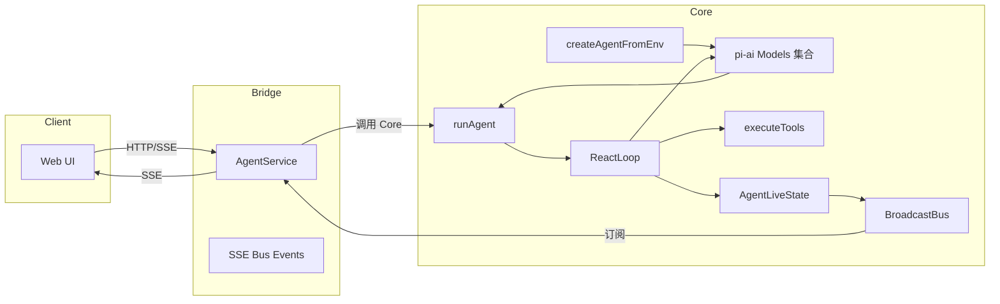

# REM 直接使用 pi-ai 作为 LLM 层的迁移方案

> 目标：让 REM Core 内部的消息、流式事件、工具、Usage 等核心数据类型直接采用 [`@earendil-works/pi-ai`](https://github.com/earendil-works/pi) 的模型，而不是在 REM 的 `LLMProvider` 接口下再包一层自建 provider 适配器。

---

## 1. 执行摘要：结论与推荐策略

### 结论

推荐采用 **“pi-ai 作为唯一 LLM 层”** 的架构：

- Core 内部直接使用 pi-ai 的 `Models` 集合、`Context`、`Message`、`AssistantMessageEvent`、`Usage`、`Tool` 等类型。
- 删除 REM 自建的 `LLMProvider` / `api-registry` / `InferenceEngine` / 自建 provider（openai、anthropic）/ 流式 parser 等模块。
- REM 的 `AgentStreamChunk` 与 `ProviderChunk` 被替换为 pi-ai 的 `AssistantMessageEvent`；REM 的自定义事件（approval、compress、session-title、budget）作为 `RemMetaEvent` 与 pi-ai 事件在同一个流中并列存在，但不冒充 LLM 事件。
- Session 持久化格式从 `ModelMessage[]` 迁移到 `pi.Message[]`，引入 `schemaVersion` 做旧数据迁移。

### 推荐策略

采用 **“先类型/数据、再流/循环、最后清理”** 的三阶段迁移：

1. **Phase 1：消息与模型层迁移**  
   把 `Session.conversation`、`ToolSet`、`Usage` 换成 pi-ai 类型；`reason/generate` 改为调用 pi-ai `Models`；保持 `AgentStreamChunk` 不变，内部通过适配器把 pi-ai 事件转成旧 chunk。该阶段即可跑通端到端对话。
2. **Phase 2：流式事件与循环迁移**  
   将 `AgentStreamChunk` / `ProviderChunk` 替换为 `AssistantMessageEvent | RemMetaEvent`；重写 `AgentStreamController`、`ReactLoop`、`AgentLiveState.applyChunk`、Bridge/Web 渲染。该阶段实现“真正的直接使用 pi-ai 事件”。
3. **Phase 3：清理与数据迁移**  
   删除旧类型、旧 provider、旧 parser；给 session 持久化加 `schemaVersion`；旧会话自动迁移到 pi-ai 格式；全量测试通过。

---

## 2. 目标态定义：什么是“直接使用 pi-ai”？

### 2.1 目标架构图



### 2.2 关键数据流

1. 启动时 `createAgentFromEnv` 构建 `AgentContext`，其中包含一个 pi-ai `Models` 集合（`builtinModels()` 或 `createModels()` + 选定的 provider）。
2. 运行前 `runAgent` 根据 `ConfigProvider` 的 `provider`/`model` 从 `Models.getModel(provider, model)` 拿到 `Model` 对象。
3. `runAgent` 把 REM 的 `Session.conversation`（`pi.Message[]`）与 system prompt、tools 组合成 `pi.Context`。
4. `ReactLoop` 调用 `models.stream(model, context, options)`，得到 `AssistantMessageEventStream`。
5. 循环消费 `AssistantMessageEvent`：
   - `text_delta` / `thinking_delta` / `toolcall_delta` 直接透传给事件流；
   - `toolcall_end` 时调用 `executeTools`；
   - 工具执行结果组装成 `pi.ToolResultMessage` 追加到 `context.messages`；
   - 当 `stopReason === 'toolUse'` 且还有工具调用时继续下一轮；
   - 当 `stopReason === 'stop'` 或 `length` 时结束。
6. REM 自定义元事件（approval、compress、session-title、budget、finish、error）在同一事件流中作为 `RemMetaEvent` 出现，但不属于 pi-ai 的 `AssistantMessageEvent`。
7. `AgentState` 订阅该统一事件流，转换成 `BusEvent` 通过 SSE 推送到 Web；Web 按 pi-ai 事件类型直接渲染。

### 2.3 类型对应速查

| REM 当前类型 | pi-ai 目标类型 | 说明 |
|-------------|----------------|------|
| `ModelMessage` | `pi.Message`（`UserMessage`/`AssistantMessage`/`ToolResultMessage`） | 系统消息进入 `Context.systemPrompt`；每条消息需要额外 REM 元数据（`remId`）供 UI 使用 |
| `ContentPart` | `TextContent` / `ThinkingContent` / `ToolCall` / `ImageContent` | `tool-result` 不再是一个 part，而是独立成 `ToolResultMessage` |
| `AgentStreamChunk` / `ProviderChunk` | `pi.AssistantMessageEvent` + `RemMetaEvent` | LLM 事件直接复用 pi-ai；REM 自定义事件作为并集 |
| `LanguageModelUsage` | `pi.Usage` | 包含 `cost` 字段；需要兼容旧 UI 的 `inputTokens/outputTokens/totalTokens` |
| `ToolSet` | `pi.Tool[]` | 工具定义直接用 TypeBox schema，pi-ai 原生支持 |

---

## 3. 当前态 vs 目标态对比表

| 维度 | 当前态 | 目标态 |
|------|--------|--------|
| LLM 入口 | `resolveProvider(provider)` + `LLMProvider.stream/generate` | `ctx.models.getModel(provider, model)` + `models.stream/complete` |
| 消息格式 | 自有的 `ModelMessage`（role + ContentPart[]） | pi-ai `Message`（role + content blocks / toolCallId） |
| 流式事件 | `AgentStreamChunk` / `ProviderChunk` 自己定义，需自建 parser | `AssistantMessageEvent` 原生，带 `contentIndex`、partial message |
| 工具定义 | `ToolSet = Record<string, ToolSchema>` | `Tool[]`（pi-ai） |
| 工具结果 | `tool-result` ContentPart | `ToolResultMessage`（独立消息） |
| Usage | 自有的 `LanguageModelUsage` | `pi.Usage`（含 cost、cache、reasoning） |
| Provider 注册 | `api-registry.ts` + `registerBuiltInProviders()` | pi-ai `Models.setProvider()` / `builtinModels()` |
| 自建 Provider | `llm/providers/openai.ts`、`anthropic.ts` | 删除，直接使用 pi-ai API 实现 |
| 流式聚合 | `InferenceEngine` + `StreamCollector` + `partitionProviderStream` | pi-ai `EventStream` + `AssistantMessageEventStream` |
| Session 持久化 | `ModelMessage[]` JSON | `pi.Message[]` JSON，带 `schemaVersion` |
| 跨模型切换 | 需要自建消息转换 | pi-ai 内部自动 handoff（thinking 转 `<thinking>` 标签） |

---

## 4. 必须迁移的核心类型

### 4.1 `ModelMessage` → `pi.Message`

当前：

```ts
export interface ModelMessage {
  id: string;
  role: 'system' | 'user' | 'assistant' | 'tool';
  content: ContentPart[];
}
```

目标：

```ts
import type { Message, AssistantMessage, UserMessage, ToolResultMessage } from '@earendil-works/pi-ai';

// 由于 pi-ai 的 Message 没有 id，REM 需要额外包裹一个元数据结构：
export interface RemMessage {
  remId: string;
  message: Message;
  // 可选：运行阶段每轮 assistant message 的 usage
  tokenUsage?: Usage;
}
```

映射规则：

| REM role | pi-ai 形式 | 说明 |
|----------|------------|------|
| `system` | 放入 `Context.systemPrompt` | 如果 REM 会话里有 system 消息，压缩后应写回 `systemPrompt` 字符串 |
| `user` | `UserMessage` | 内容 `string` 或 `TextContent/ImageContent[]` |
| `assistant` | `AssistantMessage` | 内容块为 `TextContent`/`ThinkingContent`/`ToolCall` |
| `tool` | `ToolResultMessage` | 一个 tool 调用对应一条 `ToolResultMessage` |

### 4.2 `ContentPart` → pi-ai content blocks

REM 当前 part：

```ts
type ContentPart =
  | { type: 'text'; text: string }
  | { type: 'reasoning'; text: string }
  | { type: 'tool-call'; toolCallId: string; toolName: string; arguments: unknown }
  | { type: 'tool-result'; toolCallId: string; toolName?: string; output: string; error?: string };
```

目标映射：

- `text` → `TextContent` (`{ type: 'text', text }`)
- `reasoning` → `ThinkingContent` (`{ type: 'thinking', thinking }`)
- `tool-call` → `ToolCall` (`{ type: 'toolCall', id, name, arguments }`)
- `tool-result` → `ToolResultMessage`（`{ role: 'toolResult', toolCallId, toolName, content: [{ type: 'text', text }], isError }`）

UI 渲染时，`ContentPart` 的概念可以保留为：

```ts
export type UiContentBlock = TextContent | ThinkingContent | ToolCall;
```

`tool-result` 不直接渲染，而是挂在对应 `ToolCall` 旁边展示。

### 4.3 `AgentStreamChunk` / `ProviderChunk` → `AssistantMessageEvent`

pi-ai 的 `AssistantMessageEvent` 已经覆盖了：

- `start` / `done` / `error`
- `text_start` / `text_delta` / `text_end`
- `thinking_start` / `thinking_delta` / `thinking_end`
- `toolcall_start` / `toolcall_delta` / `toolcall_end`

REM 需要扩展的元事件：

```ts
export type RemMetaEvent =
  | { type: 'step-start'; step: number }
  | { type: 'step-finish'; step: number }
  | { type: 'usage'; usage: Usage }          // 从 partial.message.usage 派生
  | { type: 'session-title'; title: string }
  | { type: 'approval-request'; sessionId: string; request: ApprovalRequest }
  | { type: 'approval-resolved'; sessionId: string; approvalId: string; decision: ApprovalDecision | null }
  | { type: 'compress-start'; sessionId: string; estimatedTokens: number; threshold: number }
  | { type: 'compress-end'; sessionId: string; archiveId: string; removedMessageCount: number }
  | { type: 'compress-error'; sessionId: string; error: string }
  | { type: 'finish'; output: AgentOutput }
  | { type: 'error'; error: Error };

export type AgentStreamEvent = AssistantMessageEvent | RemMetaEvent;
```

统一流类型：

```ts
export interface AgentStream {
  fullStream: AsyncIterable<AgentStreamEvent>;
  text: Promise<string>;
  usage: Promise<Usage>;
  steps: Promise<AgentStreamStepResult[]>;
}
```

### 4.4 `LanguageModelUsage` → `pi.Usage`

pi-ai `Usage`：

```ts
export interface Usage {
  input: number;
  output: number;
  cacheRead: number;
  cacheWrite: number;
  cacheWrite1h?: number;
  reasoning?: number;
  totalTokens: number;
  cost: { input: number; output: number; cacheRead: number; cacheWrite: number; total: number };
}
```

与 REM 旧字段映射：

| REM | pi-ai |
|-----|-------|
| `inputTokens` | `input` |
| `outputTokens` | `output` |
| `totalTokens` | `totalTokens` |
| `inputTokenDetails.cacheReadTokens` | `cacheRead` |
| `inputTokenDetails.cacheWriteTokens` | `cacheWrite` |
| `inputTokenDetails.noCacheTokens` | 可计算：`input - cacheRead - cacheWrite` |
| `outputTokenDetails.reasoningTokens` | `reasoning` |
| 无 | `cost`（新增） |

`token-usage.ts` 应改为对 `pi.Usage` 做累加；Bridge 旧 UI 可保留一个兼容转换函数。

### 4.5 `ToolSet` → `pi.Tool[]`

当前：

```ts
export type ToolSet = Record<string, ToolSchema>;
```

目标：

```ts
import type { Tool } from '@earendil-works/pi-ai';
// ToolProvider.getToolSet() -> Tool[]
```

转换函数：

```ts
function toPiTool(def: ToolDefinition): Tool {
  return {
    name: def.name,
    description: def.description,
    parameters: def.parameters, // TypeBox schema 直接兼容
  };
}
```

---

## 5. 按模块的迁移清单

### 5.1 `core/types.ts`

- 删除 `ModelMessage`、`ContentPart`、`MessageContent`。
- 删除 `LanguageModelUsage`（或作为 `pi.Usage` 的兼容别名保留到 Phase 3）。
- 删除 `AgentStreamChunk`、`ProviderChunk` 的 LLM 事件部分，替换为 `AgentStreamEvent = AssistantMessageEvent | RemMetaEvent`。
- 保留 `UserInput`、`AgentOutput`、`AgentStream`（字段类型改）、`AgentStreamStepResult`、`ToolCallRecord`、`TurnResult`。
- `TurnResult.newMessages` 改为 `pi.Message[]`。

### 5.2 `core/state.ts` / `core/session.ts`

- `session.ts`：`Session.conversation` 改为 `pi.Message[]`；添加 `schemaVersion: number` 到 metadata 或 session 顶层。
- `state.ts`：
  - `StreamingSnapshot.parts` 改为 `pi.TextContent | pi.ThinkingContent | pi.ToolCall` 的数组（即 assistant 当前 partial 内容）。
  - `tokenUsage` 改为 `pi.Usage`。
  - `applyChunk` 改为处理 `AssistantMessageEvent` / `RemMetaEvent`；`activity` 从 `text_delta`/`thinking_delta`/`toolcall_delta` 推导。
  - `appendSnapshotParts` 从 pi-ai 事件更新 partial message。

### 5.3 `core/stream/*`

- `agent-stream.ts`：
  - 重写为 `AgentEventStreamController`。
  - 接受 `AssistantMessageEvent` 和 `RemMetaEvent`。
  - `messageStart()` 映射到 pi-ai `start` 事件；`stepStart/Finish` 保持为元事件。
  - `finish()` 映射到 `RemMetaEvent<'finish'>`。
- `stream-aggregators.ts`：
  - 重写 `aggregateText`/`aggregateUsage`/`aggregateSteps` 为从 pi-ai 事件流聚合。
  - 删除 `reduceStreamChunk` 的旧 REM 分支，改为对 pi-ai 内容块的追加逻辑。

### 5.4 `core/reason/reason.ts`

- `ReasonParams` / `GenerateParams` 中的 `messages` 改为 `pi.Message[]`，`tools` 改为 `pi.Tool[]`。
- `reason()` 函数：
  - 不再使用 `resolveProvider` / `InferenceEngine` / `StreamCollector`。
  - 使用 `models.stream(model, context, options)` 获取 `AssistantMessageEventStream`。
  - 遍历事件流，把 `text_delta`/`thinking_delta`/`toolcall_end` 转成目标事件或旧 `ProviderChunk`（Phase 1 用旧 chunk；Phase 2 直接透传）。
  - 返回 `stream.result()` 得到 `AssistantMessage`，提取 text / thinking / toolCalls / usage / finishReason。
- `generate()` 函数：使用 `models.complete(model, context, options)` 返回 `AssistantMessage`。

### 5.5 `core/run-agent.ts`

- 使用 `ctx.models` 获取 `Model` 对象。
- 构建 `pi.Context`：

  ```ts
  const context: Context = {
    systemPrompt: systemPrompt,
    messages: session.conversation, // pi.Message[]
    tools: toolProviderWithDelegate.getToolSet(), // pi.Tool[]
  };
  ```

- 把 `message-start` 的 `messageId` 记录逻辑移到 pi-ai `start` 事件的 `partial.message`（用 `partial.timestamp` 或 REM 的 `remId`）。
- 压缩逻辑：压缩后的 system 摘要写回 `context.systemPrompt`；压缩后的历史消息作为 `context.messages`。
- 工具执行时，把结果转换成 `ToolResultMessage` 追加到 `context.messages`。
- 标题生成用 `models.complete`。

### 5.6 `core/llm/*`

- 删除 `api-registry.ts`：pi-ai 的 `Models` 已经承担注册/路由职责。
- 删除 `engine.ts`：不需要自建 `InferenceEngine`。
- 删除 `stream-collector.ts`：pi-ai `AssistantMessageEventStream.result()` 已经收集结果。
- 删除 `partition-stream.ts`：pi-ai 已经处理 thinking 分块。
- 删除 `providers/openai.ts` 和 `providers/anthropic.ts`：pi-ai 提供对应 API 实现。
- 删除 `providers/index.ts`：改为 `packages/core/src/llm/models.ts` 创建 `Models` 集合。
- 保留 `llm/context-window.ts`（模型上下文窗口逻辑仍需要）。
- 保留 `llm/types.ts` 直到 Phase 3 删除，或仅保留 `ProviderConfig` 作为过渡。

### 5.7 `core/plugins/loop/react/index.ts`

- 重写 `ReactLoop.run`：
  - 调用 `ctx.stream()` 获取 `AssistantMessageEventStream`。
  - 在事件循环中直接追加 content block 到当前 assistant message（而不是等 `reason()` 返回后再 append）。
  - `toolcall_end` 时收集完整 `ToolCall`，调用 `ctx.execute()`。
  - 当 `stopReason === 'toolUse'` 时继续循环；否则 break。
  - 返回 `{ content, usage }`，其中 `usage` 来自最终 `AssistantMessage.usage`。
- 删除 `ensureAssistantMessage` / `appendToAssistantMessage` 的旧 ContentPart 逻辑，改为 pi-ai 内容块追加。

### 5.8 `core/sdk/loop-strategy.ts`

- `LoopContext` 改为：

  ```ts
  export interface LoopContext {
    liveState: AgentLiveState;
    system: string;
    messages: Message[];

    stream: (options?: StreamOptions) => AssistantMessageEventStream;
    generate: (options?: StreamOptions) => Promise<AssistantMessage>;
    execute: (calls: ToolCall[]) => Promise<ToolResult[]>;
    emit: (event: AgentStreamEvent) => void | Promise<void>;

    addMessage: (role: 'assistant' | 'tool') => RemMessage;
    appendContent: (msg: RemMessage, block: TextContent | ThinkingContent | ToolCall) => void;

    signal?: AbortSignal;
    maxSteps?: number;
    workspaceRoot: string;
    readOnly?: boolean;
    agentName?: string;
    sessionId?: string;
  }
  ```

- `LoopResult` 中的 `usage` 改为 `pi.Usage`。

### 5.9 `core/sdk/tool-provider.ts`

- `ToolProvider.getToolSet()` 返回 `pi.Tool[]` 而不是 `ToolSet`。
- `ToolCall` 结构可以保留，但字段名对齐：`toolCallId` → `id`（pi-ai）。
- `ToolResult.output` 仍作为字符串；执行层负责生成 `ToolResultMessage`。

### 5.10 `core/execute/execute-tools.ts`

- `emitToolResult` 不再 emit `ProviderChunk` 的 `tool-result`，而是：
  1. emit `RemMetaEvent` 形式的工具结果（如果 UI 仍需要显式 event）；
  2. 创建 `pi.ToolResultMessage` 并追加到会话。
- 错误结果用 `isError: true`。
- 工具结果消息格式：

  ```ts
  {
    role: 'toolResult',
    toolCallId: tc.toolCallId,
    toolName: tc.toolName,
    content: [{ type: 'text', text: result.output ?? '' }],
    isError: !!result.error,
    timestamp: Date.now(),
  }
  ```

### 5.11 `core/plugins/session/*` / `state/*`

- `BaseSessionProvider`：
  - `addMessage` 返回 `RemMessage`；内部生成 `remId` 并创建对应的 pi-ai 消息。
  - `appendContent` 改为追加 pi-ai content block 或追加 `ToolResultMessage`。
- `JsonlSessionStore`：JSON 序列化 `pi.Message[]`，需要把 `Date` 等不可序列化字段处理掉（pi-ai 用 `timestamp: number`）。
- 数据迁移：加载旧 session 时，如果 `schemaVersion < 2`，调用 `migrateConversationToPiAi()` 转换并保存。
- `InMemorySessionProvider`、`SqliteSessionProvider`、`LocalSessionProvider` 同步调整。

### 5.12 `bridge/types.ts` / `sse.ts` / `agent.ts` / `client.ts`

- `types.ts`：
  - `UIMessage.parts` 改为 `UiContentBlock[]`（`pi.TextContent | pi.ThinkingContent | pi.ToolCall`）。
  - `ServerStreamEvent` 改为 `AgentStreamEvent`。
  - `LanguageModelUsage` 改为 `pi.Usage`。
- `sse.ts`：
  - `parseAgentStreamEvent` 改为解析 `AgentStreamEvent`；`error` 事件格式兼容。
- `agent.ts`：
  - 订阅 `BusEvent` 时，`snapshot` 的 `parts` 改为 pi-ai content blocks。
- `client.ts`：导出 `AgentStreamEvent`、`UiContentBlock` 等。

### 5.13 `web/lib/stream-parser.ts` / `web/lib/types.ts`

- `web/lib/types.ts`：is 类型守卫改为 pi-ai 事件类型。
- 如果项目没有 `stream-parser.ts`，新建一个 `pi-event-helpers.ts`：提供 `isTextDelta`、`isThinkingDelta`、`isToolCallEnd` 等守卫，以及从 `AssistantMessage` 提取文本和工具调用的辅助函数。

### 5.14 `web/components/chat/*`

- `message-item.tsx`：
  - `message.parts` 改为 pi-ai content blocks；渲染逻辑：
    - `type === 'text'` → Markdown
    - `type === 'thinking'` → ReasoningBlock
    - `type === 'toolCall'` → ToolCallBlock + 查找对应 ToolResultMessage
- `reasoning-block.tsx`：接收 `thinking: string` 即可。
- `tool-call-block.tsx`：工具参数改为 `tool.arguments`（pi-ai）；`toolCallId` 改为 `tool.id`。

---

## 6. 分阶段迁移计划

### Phase 1：消息与模型层迁移（可验证：一次对话能跑通）

**目标**

- 把 `Session.conversation`、`ToolSet`、`Usage` 替换为 pi-ai 类型。
- 删除 `api-registry` / `InferenceEngine` / `StreamCollector` / 自建 providers，改用 `pi-ai Models`。
- 保持 `AgentStreamChunk` 接口不变，内部通过适配器把 pi-ai 事件转成旧 chunk，从而不破坏 Bridge/Web。

**改动的文件**

1. `packages/core/package.json`：新增依赖 `@earendil-works/pi-ai`。
2. 新增 `packages/core/src/pi-adapter.ts`：
   - `toPiMessage(remMessage)` / `fromPiMessage(message, remId)`
   - `toPiTool(def)` / `toPiToolResultMessage(tc, result)`
   - `toLegacyChunk(event)`（把 pi-ai 事件转成旧 `AgentStreamChunk`）
   - `usageToLegacy(u)` / `usageFromLegacy(u)`
3. `packages/core/src/types.ts`：新增 `RemMessage`、`AgentStreamEvent` 类型；保留旧的 `AgentStreamChunk`。
4. `packages/core/src/session.ts`：conversation 改为 `pi.Message[]`；metadata 增加 `schemaVersion`。
5. `packages/core/src/sdk/session-provider.ts`、`core/plugins/session/*`：读写 pi-ai 消息；加载旧 session 时迁移。
6. `packages/core/src/llm/models.ts`：创建 `Models` 集合，暴露 `createCoreModels()`。
7. `packages/core/src/agent-context.ts`：增加 `models: Models`。
8. `packages/core/src/agent-context-builder.ts`：初始化 `Models`；移除 `registerBuiltInProviders()` 调用。
9. `packages/core/src/reason/reason.ts`：使用 `models.stream` / `models.complete`，内部转成旧 `ProviderChunk`。
10. `packages/core/src/run-agent.ts`：构建 `pi.Context`；调用 pi-ai 模型。
11. `packages/core/src/sdk/tool-provider.ts`、`tool-composer.ts`：`getToolSet()` 返回 `pi.Tool[]`。
12. `packages/core/src/execute/execute-tools.ts`：生成 `ToolResultMessage`。
13. 删除 `packages/core/src/llm/api-registry.ts`、`engine.ts`、`stream-collector.ts`、`partition-stream.ts`、`providers/*`（或移到 `deprecated/`）。

**验证方式**

- `pnpm typecheck` 通过。
- `pnpm test` 通过。
- 使用 faux provider 或任意内置 provider（如 openai）运行一次完整对话（用户输入 → assistant 回复 → 工具调用 → 工具结果 → assistant 最终回复）。
- 检查 session 文件是否正确保存为 pi-ai 消息格式且 `schemaVersion >= 2`。

---

### Phase 2：流式事件与循环迁移（可验证：流式渲染正常）

**目标**

- 将 `AgentStreamChunk` 替换为 `AgentStreamEvent = AssistantMessageEvent | RemMetaEvent`。
- 重写 `AgentStreamController`、`ReactLoop`、`AgentLiveState.applyChunk`、Bridge 事件转换、Web 渲染。

**改动的文件**

1. `packages/core/src/types.ts`：删除旧 `AgentStreamChunk` / `ProviderChunk`，把 `AgentStream` 的 `fullStream` 改为 `AsyncIterable<AgentStreamEvent>`。
2. `packages/core/src/stream/agent-stream.ts`：重写为 `AgentEventStreamController`，支持 pi-ai 事件和元事件。
3. `packages/core/src/stream/stream-aggregators.ts`：从 pi-ai 事件聚合 text、usage、steps。
4. `packages/core/src/state.ts`：重写 `applyChunk` 和 snapshot 逻辑。
5. `packages/core/src/agent-state.ts`：`applyChunk` 处理 `AgentStreamEvent`。
6. `packages/core/src/bus-events.ts`：snapshot 的 `parts` 改为 pi-ai content blocks；`chunk` 类型改为 `AgentStreamEvent`。
7. `packages/core/src/reason/reason.ts`：直接透传 `AssistantMessageEvent` 到 `emit`。
8. `packages/core/src/plugins/loop/react/index.ts`：消费 `AssistantMessageEventStream` 并实时追加内容。
9. `packages/core/src/sdk/loop-strategy.ts`：`LoopContext` 增加 `stream/generate`。
10. `packages/bridge/src/types.ts`、`sse.ts`、`agent.ts`、`client.ts`：使用 `AgentStreamEvent`。
11. `packages/bridge/src/stream-reducer.ts`：从 pi-ai 事件更新 UI 状态。
12. `packages/web/src/lib/types.ts`：改为 pi-ai 类型守卫。
13. `packages/web/src/components/chat/message-item.tsx`、`reasoning-block.tsx`、`tool-call-block.tsx`：按 pi-ai content blocks 渲染。

**验证方式**

- 流式对话时，Web UI 能正常显示 text/thinking/tool-call 的增量更新。
- 工具调用时能看到 toolcall_delta 的进度（至少能看到参数逐渐出现）。
- 审批、压缩、session-title 事件仍正常展示。
- 中断/重连后 snapshot 能恢复当前 assistant 消息的内容块。

---

### Phase 3：清理与数据迁移（可验证：全量测试通过，旧会话可读）

**目标**

- 删除所有遗留的 REM LLM 类型与文件。
- 给持久化加 `schemaVersion`；旧会话自动迁移。
- 更新测试与文档。

**改动的文件**

1. `packages/core/src/types.ts`：删除 `LanguageModelUsage` 兼容别名、`AgentStreamChunk` 兼容别名。
2. `packages/core/src/llm/types.ts`：如果已无其他引用，删除。
3. `packages/core/src/token-usage.ts`：完全基于 `pi.Usage`。
4. `packages/core/src/pi-adapter.ts`：删除 `toLegacyChunk` 等过渡函数；保留迁移函数。
5. `packages/core/src/plugins/session/jsonl-store.ts` / `base.ts`：写入时加 `schemaVersion`；读取时执行迁移。
6. 删除 `packages/core/src/llm/providers/` 目录和 `api-registry.ts` 等（如果 Phase 1 没删干净）。
7. 更新 `packages/core/README.md` 和 `docs/core-design.md` 中关于 LLM 层的描述。
8. 补充/更新测试用例：
   - 旧 session JSON 的迁移测试。
   - pi-ai 事件流聚合测试。
   - 跨 provider handoff 测试（可选）。

**验证方式**

- `pnpm typecheck && pnpm test` 全绿。
- 启动旧版本创建的 session，能正常加载历史消息并继续对话。
- 新创建的 session 文件格式为 pi-ai `Message[]`，包含 `schemaVersion: 2`。

---

## 7. 数据迁移策略：旧 session 如何迁移？

### 7.1 Schema Version

在 `Session` metadata（或顶层）加入：

```ts
interface Session {
  sessionId: string;
  conversation: Message[];
  currentTurn: number;
  metadata: Record<string, unknown> & { schemaVersion?: number };
  createdAt: Date;
  updatedAt: Date;
}
```

- `schemaVersion = 1`：旧 REM `ModelMessage[]` 格式。
- `schemaVersion = 2`：pi-ai `Message[]` 格式。

### 7.2 迁移函数

```ts
export function migrateConversationToPiAi(
  legacy: LegacyModelMessage[],
): { messages: Message[]; messageIds: Map<string, string> } {
  const remIds = new Map<string, string>();
  const messages: Message[] = [];

  for (const m of legacy) {
    const remId = m.id;
    if (m.role === 'system') {
      // system 消息压缩后通常只剩一条，迁移时忽略或合并到 systemPrompt
      continue;
    }

    if (m.role === 'user') {
      const text = m.content
        .filter((p) => p.type === 'text')
        .map((p) => p.text)
        .join('\n');
      const message: UserMessage = { role: 'user', content: text, timestamp: Date.now() };
      remIds.set(remId, message.timestamp.toString()); // 或额外维护 metadata
      messages.push(message);
    } else if (m.role === 'assistant') {
      const content: AssistantMessage['content'] = [];
      for (const p of m.content) {
        if (p.type === 'text') content.push({ type: 'text', text: p.text });
        else if (p.type === 'reasoning') content.push({ type: 'thinking', thinking: p.text });
        else if (p.type === 'tool-call') {
          content.push({ type: 'toolCall', id: p.toolCallId, name: p.toolName, arguments: p.arguments as any });
        }
      }
      const message: AssistantMessage = {
        role: 'assistant',
        content,
        api: 'openai-completions', // 旧数据无法准确还原，用默认值
        provider: 'unknown',
        model: 'unknown',
        usage: { input: 0, output: 0, cacheRead: 0, cacheWrite: 0, totalTokens: 0, cost: { input: 0, output: 0, cacheRead: 0, cacheWrite: 0, total: 0 } },
        stopReason: 'stop',
        timestamp: Date.now(),
      };
      remIds.set(remId, message.timestamp.toString());
      messages.push(message);
    } else if (m.role === 'tool') {
      for (const p of m.content) {
        if (p.type === 'tool-result') {
          messages.push({
            role: 'toolResult',
            toolCallId: p.toolCallId,
            toolName: p.toolName ?? '',
            content: [{ type: 'text', text: p.output }],
            isError: !!p.error,
            timestamp: Date.now(),
          });
        }
      }
    }
  }

  return { messages, messageIds: remIds };
}
```

### 7.3 迁移流程

1. `SessionProvider.load(sessionId)` 读取原始 JSON。
2. 如果 `metadata.schemaVersion === 1`（或不存在且 conversation 是旧 shape），调用 `migrateConversationToPiAi()`。
3. 把迁移后的消息写回 store，metadata 设置 `schemaVersion = 2`。
4. 如果迁移失败，记录错误并返回一个空 session（避免整个应用崩溃）。

### 7.4 保留 REM 元数据

由于 pi-ai `Message` 没有 `id`，REM 的 UI 需要消息 id。可以在 session metadata 里维护：

```ts
metadata.messageMeta = {
  [timestampOrIndex]: { remId: string, tokenUsage?: Usage }
}
```

或者使用 `RemMessage` 包装并在持久化时分离存储：一个 `messages.json`（pi-ai） + 一个 `message-meta.json`（REM id）。

---

## 8. 新入口设计：Core 如何初始化 pi-ai 的 Models 集合？`createAgentFromEnv` 如何变化？

### 8.1 新增 `Models` 到 `AgentContext`

```ts
import type { Models } from '@earendil-works/pi-ai';

export interface AgentContext {
  // ... 其他不变
  models: Models;
}
```

### 8.2 创建 Models 集合

新建 `packages/core/src/llm/models.ts`：

```ts
import { createModels } from '@earendil-works/pi-ai';
import { builtinModels } from '@earendil-works/pi-ai/providers/all';
import type { Models } from '@earendil-works/pi-ai';

export interface CreateCoreModelsOptions {
  providers?: 'all' | 'minimal';
  customProviders?: Provider[];
}

export function createCoreModels(options?: CreateCoreModelsOptions): Models {
  const models = options?.providers === 'all' ? builtinModels() : createModels();
  for (const p of options?.customProviders ?? []) {
    models.setProvider(p);
  }
  return models;
}
```

### 8.3 `createAgentFromEnv` 变化

```ts
export async function createAgentFromEnv(options?: CreateAgentOptions): Promise<AgentContext> {
  const models = createCoreModels({ providers: 'all' }); // 或按需注册
  return buildAgentContext({ ...options, models });
}
```

`buildAgentContext` 接收可选的 `models` 参数；如果未提供则内部创建默认集合。

### 8.4 运行时模型选择

```ts
const model = ctx.models.getModel(effectiveModel.provider, effectiveModel.model);
if (!model) {
  throw new Error(`Unknown model: ${effectiveModel.provider}/${effectiveModel.model}`);
}

const stream = ctx.models.stream(model, context, {
  signal: params.signal,
  apiKey: effectiveModel.apiKey, // 如果 config 中显式配置了 apiKey
  // 其他选项：temperature, maxTokens, reasoning, cacheRetention, sessionId...
});
```

### 8.5 关于“Provider 配置由 Core 拥有”的红线

pi-ai 本身会读取环境变量（如 `OPENAI_API_KEY`），但这发生在 Core 内部。Bridge/Web/Demo 仍然：

- 不直接读取 `OPENAI_API_KEY` 等环境变量。
- 只调用 `createAgentFromEnv({ provider, model })` 或其他 Core 入口。

如果用户通过 REM 配置文件显式配置 `apiKey`，Core 将其作为 `options.apiKey` 传给 pi-ai，显式 key 优先于环境变量。

---

## 9. 流式事件直接使用 pi-ai 的利弊

### 9.1 利

| 收益 | 说明 |
|------|------|
| 无需自建 parser | OpenAI、Anthropic、Google 等流式协议由 pi-ai 内部解析，REM 不再维护 `openai-adapter.ts`、`anthropic-adapter.ts` 等。
| 支持 `toolcall_delta` | 工具参数可以增量显示，无需自己拼 JSON。
| thinking 自动分离 | pi-ai 已经把 `thinking` 作为独立 content block 和事件，无需 `ThinkingTagPartitioner`。
| 跨 provider handoff | 同一次会话可以在 Claude 和 OpenAI 之间切换，pi-ai 会自动转换 thinking block、tool call ID 等。
| 统一 usage 与 cost | 每个 `AssistantMessage` 自带 `usage` 和 `cost`，无需自建累加逻辑。
| 兼容层变薄 | `LLMProvider` / `api-registry` 等中间层可以完全删除。

### 9.2 弊

| 风险 | 说明 |
|------|------|
| Web/Bridge 强耦合到 pi-ai | 前端类型守卫、渲染组件依赖 pi-ai 的事件结构；pi-ai 升级可能带来 breaking change。
| 事件粒度控制降低 | 例如 REM 的 `step` 编号、`message-start` 的 `messageId` 等不再由 LLM 层提供，需要在 REM 元事件层补充。
| 自定义事件需要旁路 | approval、compress、session-title 不是 pi-ai 原生事件，需要设计 `RemMetaEvent` 并保证与 pi-ai 事件顺序一致。
| 调试复杂度 | 遇到 provider 特殊行为时，需要在 pi-ai 层调试，而不是直接看原始 OpenAI/Anthropic payload（虽然 `onPayload`/`onResponse` 回调仍可查看）。
| bundle 体积 | `builtinModels()` 会拉入所有 provider 的 catalog，虽然 SDK 是 lazy 加载，但类型/模型元数据会增加打包体积。服务器端影响较小，浏览器端若直接依赖会更大。 |

---

## 10. 与 REM 现有架构的冲突点

### 10.1 `approval-request` / `approval-resolved` 事件如何融入 pi-ai 事件流？

**方案**：不归入 pi-ai 的 `AssistantMessageEvent`，而是作为 `RemMetaEvent` 在统一的 `AgentStreamEvent` 中发射。

```ts
export type AgentStreamEvent = AssistantMessageEvent | RemMetaEvent;
```

`executeTools` 在需要人工审批时 emit `approval-request` 元事件，然后阻塞等待审批；审批完成后 emit `approval-resolved` 元事件，再继续执行。Bridge/Web 通过 `BusEvent` 中 `type: 'chunk'` 的元事件展示审批弹窗。

### 10.2 `compress-start` / `compress-end` 事件如何融入？

同样作为 `RemMetaEvent`。`runAgent` 在调用 compressor 前后 emit：

```ts
emit({ type: 'compress-start', sessionId, estimatedTokens, threshold });
// ... 压缩 ...
emit({ type: 'compress-end', sessionId, archiveId, removedMessageCount });
```

这些事件与 pi-ai 的 LLM 事件共享同一个 `AgentStreamEvent` 流，因此 Web 可以按顺序展示“正在压缩上下文…”。

### 10.3 `session-title` 事件如何融入？

`session-title` 也是元事件。`forkTitleGeneration` 在标题生成后 emit：

```ts
emit({ type: 'session-title', title });
```

标题生成本身使用 `models.complete`，不通过主事件流返回。

### 10.4 `budget` 检查应该放在 pi-ai 事件流外还是事件流内？

**结论**：budget 检查属于 REM 的业务规则，应该放在 pi-ai 事件流之外。

具体位置：

- **循环前**：`runAgent` 在启动循环前检查 `budgetPolicy.checkTurn()` 和 `checkTimeout()`，如果失败直接 emit `finish` 元事件并返回。
- **每轮结束后**：`ReactLoop` 每完成一轮后检查 `liveState.canContinue()`，如果 budget 耗尽，不再调用 `models.stream`。
- **stream 内**：如果收到 `usage` 更新后超过预算，可以主动 abort signal 并 emit 元事件，但这属于额外保护，不应是主要逻辑。

---

## 11. 风险清单与回退策略

| 风险 | 影响 | 缓解/回退策略 |
|------|------|---------------|
| pi-ai 版本升级导致 breaking change | Web/Bridge 类型编译失败 | 1. 锁住 pi-ai 版本；2. 在 Core 层做一层 thin facade（仅对最不稳定的部分）；3. 升级前跑全量测试。 |
| 自建 provider 删除后，某些边缘 provider 不支持 | 无法使用特定模型 | 通过 pi-ai 的 `createProvider` + `openai-completions` 等 API 实现自定义 provider；保留一个 REM 自定义 provider 注册入口。 |
| 工具 schema 转换不兼容 | 工具调用失败 | 在 `toPiTool` 中加单元测试；对 `parameters` 为 `Record` 而非 TypeBox 的旧工具做兼容校验。 |
| 旧 session 数据迁移失败 | 历史会话无法打开 | 1. 迁移函数加 try/catch；2. 失败时返回空会话并记录错误；3. 保留旧格式备份。 |
| 流式事件顺序/快照恢复异常 | 重连后 UI 状态不一致 | 用 pi-ai 的 `partial` 维护 snapshot；重连时直接重放完整 `AssistantMessage` partial。 |
| 审批流与 pi-ai 事件流交错顺序错误 | 审批 UI 出现在错误位置 | 在 `AgentEventStreamController` 中保证元事件按 emit 顺序输出；单元测试验证顺序。 |
| 成本/usage 显示不一致 | 用户看到错误 token 数 | 统一使用 `pi.Usage`，在 UI 增加 cost 展示，并对旧 `LanguageModelUsage` 做转换测试。 |
| 迁移期间开发分支冲突 | 多人同时修改同一块代码 | 按 Phase 1/2/3 分 PR；每个 Phase 尽量保持可编译；每 Phase 结束前做 rebase。 |
| 删除 `api-registry` 后外部依赖者（Demo/CLI）编译失败 | 如果 Demo 直接 import `resolveProvider` | 在 `index.ts` 中保留 deprecated 重定向一个版本周期，或一次性修复所有 Demo/CLI。 |

---

## 附录：参考文件变更索引

| 文件 | 动作 | 阶段 |
|------|------|------|
| `packages/core/package.json` | 新增 `@earendil-works/pi-ai` 依赖 | 1 |
| `packages/core/src/types.ts` | 迁移核心类型，定义 `AgentStreamEvent` | 1/2 |
| `packages/core/src/session.ts` | conversation 改 `pi.Message[]`，加 schemaVersion | 1 |
| `packages/core/src/state.ts` | 按 pi-ai 事件维护 activity / snapshot | 2 |
| `packages/core/src/stream/agent-stream.ts` | 重写为 `AgentEventStreamController` | 2 |
| `packages/core/src/stream/stream-aggregators.ts` | 从 pi-ai 事件聚合 | 2 |
| `packages/core/src/reason/reason.ts` | 使用 `models.stream/complete` | 1 |
| `packages/core/src/run-agent.ts` | 构建 `pi.Context`，调用 pi-ai 模型 | 1 |
| `packages/core/src/llm/api-registry.ts` | 删除 | 1 |
| `packages/core/src/llm/engine.ts` | 删除 | 1 |
| `packages/core/src/llm/stream-collector.ts` | 删除 | 1 |
| `packages/core/src/llm/partition-stream.ts` | 删除 | 1 |
| `packages/core/src/llm/providers/*` | 删除 | 1 |
| `packages/core/src/llm/models.ts` | 新建：创建 pi-ai Models 集合 | 1 |
| `packages/core/src/plugins/loop/react/index.ts` | 消费 `AssistantMessageEventStream` | 2 |
| `packages/core/src/sdk/loop-strategy.ts` | 更新 `LoopContext` | 2 |
| `packages/core/src/sdk/tool-provider.ts` | `getToolSet()` 返回 `pi.Tool[]` | 1 |
| `packages/core/src/execute/execute-tools.ts` | 生成 `ToolResultMessage` | 1 |
| `packages/core/src/plugins/session/*` | 存储 pi-ai 消息并迁移旧数据 | 1/3 |
| `packages/core/src/agent-context.ts` | 增加 `models` | 1 |
| `packages/core/src/agent-context-builder.ts` | 初始化 `Models` | 1 |
| `packages/core/src/agent-factory.ts` | 透传 `models` | 1 |
| `packages/bridge/src/types.ts` | 改 UIMessage / ServerStreamEvent | 2 |
| `packages/bridge/src/sse.ts` | 解析 `AgentStreamEvent` | 2 |
| `packages/bridge/src/agent.ts` | 元事件处理 | 2 |
| `packages/bridge/src/client.ts` | 导出新类型 | 2 |
| `packages/web/src/lib/types.ts` | pi-ai 类型守卫 | 2 |
| `packages/web/src/components/chat/message-item.tsx` | 按 pi-ai content blocks 渲染 | 2 |
| `packages/web/src/components/chat/reasoning-block.tsx` | 接收 `thinking` 字符串 | 2 |
| `packages/web/src/components/chat/tool-call-block.tsx` | 使用 `tool.arguments` / `tool.id` | 2 |

---

> 本方案按阶段实施，可执行且可回退。实施完成后，REM 的 LLM 层将完全依赖 pi-ai 的抽象，同时保留 REM 的 Agent 循环、审批、预算、压缩、会话持久化等自有业务逻辑。
