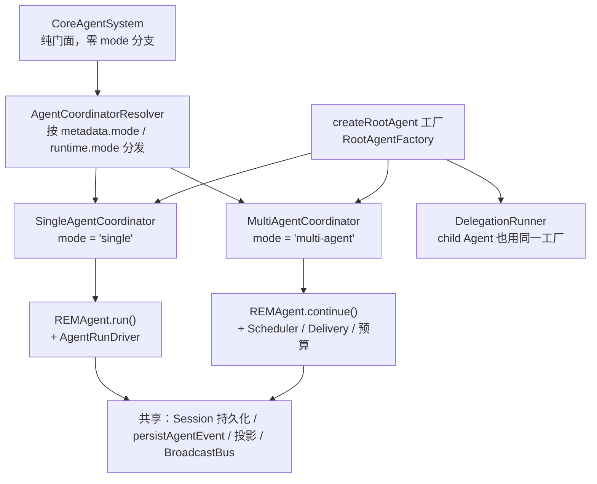

# AgentCoordinator 抽象与模式分发重构 Implementation Plan

> **For agentic workers:** REQUIRED SUB-SKILL: Use superpowers:subagent-driven-development (recommended) or superpowers:executing-plans to implement this plan task-by-task. Steps use checkbox (`- [ ]`) syntax for tracking.

**Goal:** 抽象出统一的 `AgentCoordinator` 接口，单 Agent 与多 Agent 两条路径分别实现为 `SingleAgentCoordinator` 与 `MultiAgentCoordinator`（两者都显式依赖 `createRootAgent`），`CoreAgentSystem` 通过 resolver 按 Session 模式分发，消除全部 mode 分支。

**Architecture:** `AgentCoordinator` 定义 Session 运行时的四个生命周期操作（createRuntime / send / interrupt / recoverProcessing）。单 Agent 路径从 `CoreAgentSystem` 抽成新的 `SingleAgentCoordinator`；现有 `MultiAgentCoordinator` 直接 `implements` 该接口（方法签名已天然一致），并把依赖名 `createAgent` 对齐为 `createRootAgent`。`AgentCoordinatorResolver` 按 `Session.metadata.mode` / `runtime.mode` 解析对应 coordinator。`CoreAgentSystem` 退化为纯门面：Session CRUD、聊天投影、事件流、按模式分发。

**Tech Stack:** TypeScript (NodeNext), Vitest, pnpm workspace (`packages/core`)

---

## 目标架构



## 现状分析（为什么这样切）

### 关键认知：`createRootAgent` 是共享工厂，不是单 Agent 分支

`create-agent-system.ts:33` 的 `createAgent` 同时注入三处：`CoreAgentSystem`（单 Agent root）、`DelegationRunner`（child Agent）、`MultiAgentCoordinator`（每个 thread 的 Agent）。两条链路殊途同归于**同一工厂的 `REMAgent` 和同一套持久化/投影基础设施**，差异只在"谁驱动 Agent、消息如何流转"——这正是 `AgentCoordinator` 的抽象边界。

### 真正的分支点（本次消除对象）

`system/agent-system.ts` 中 4 处 mode 分支：`send`（:88）、`interrupt`（:112）、`createRuntime`（:128）、`ensureRecovery`（:121-124）。

### 可抽象 vs 个性化

| 可抽象（进入接口/共享） | 个性化（留在各实现内） |
|---|---|
| createRuntime / send / interrupt / recoverProcessing 四个操作的契约 | 单 Agent：ensurePrimaryThread、`agent.run()` + `AgentRunDriver.drive` |
| `createRootAgent` 工厂依赖（两者共有，接口级显式声明） | 多 Agent：Delivery 队列、Scheduler、Discussion 预算、编排工具绑定、按 thread 重投影、recoverProcessing |
| `SessionRuntime` 生命周期、持久化、投影、事件总线 | — |

### 非目标（本次不做）

- 不合并两边重复的"创建 REMAgent + runDelegation 闭包"代码（可后续抽公共 helper，行为不变优先）。
- 不改 `Session.metadata.mode` 写入点（`session-usecase.ts:26`）与 `SessionInfo.mode` 归一化。
- 不动 `createSession` 中 `ensureTeamThreads` 的 teamId 分支（创建期线程供给，不属于运行时分发）。
- 不消除 `getSessionChat` / `multi-agent-event-handler` 中按 `thread.role` 的分支（role 分支，非 mode 分支）。

---

## 文件结构

| 文件 | 职责 | 操作 |
|---|---|---|
| `packages/core/src/orchestration/agent-coordinator-types.ts` | `SessionMode`、`AgentCoordinator` 接口、共享 deps | 新建 |
| `packages/core/src/orchestration/coordinator-resolver.ts` | `resolveSessionMode` + `AgentCoordinatorResolver` 分发 | 新建 |
| `packages/core/src/orchestration/single-agent-coordinator.ts` | 单 Agent 实现（从 agent-system.ts 搬入） | 新建 |
| `packages/core/src/orchestration/multi-agent-coordinator.ts` | `implements AgentCoordinator`；依赖名 `createAgent` → `createRootAgent` | 修改 |
| `packages/core/src/orchestration/multi-agent-coordinator-types.ts` | deps 字段改名对齐 | 修改 |
| `packages/core/src/system/agent-system.ts` | 删除全部 mode 分支，改用 resolver 分发 | 修改（169 → ~115 行） |
| `packages/core/src/system/create-agent-system.ts` | 装配两个 coordinator 并注册 | 修改 |
| `packages/core/tests/coordinator-resolver.test.ts` | resolver 单元测试 | 新建 |

依赖方向：`orchestration`、`system` 同属结构检查的 `(root)` 域，`FORBIDDEN` 边（`scripts/check-structure.mjs:13-18`）不涉及，合规。

---

### Task 1: AgentCoordinator 接口与 Resolver

**Files:**
- Create: `packages/core/src/orchestration/agent-coordinator-types.ts`
- Create: `packages/core/src/orchestration/coordinator-resolver.ts`
- Test: `packages/core/tests/coordinator-resolver.test.ts`

- [ ] **Step 1: Write the failing test**

```typescript
// packages/core/tests/coordinator-resolver.test.ts
import { describe, expect, it } from 'vitest';
import type { Session } from '../src/session/model.js';
import type { SessionRuntime } from '../src/session/runtime.js';
import type { AgentCoordinator } from '../src/orchestration/agent-coordinator-types.js';
import { resolveSessionMode, AgentCoordinatorResolver } from '../src/orchestration/coordinator-resolver.js';

function fakeSession(mode: unknown): Session {
  return { sessionId: 's1', metadata: { mode } } as unknown as Session;
}

function fakeCoordinator(mode: 'single' | 'multi-agent'): AgentCoordinator {
  return {
    mode,
    createRuntime: async () => { throw new Error('unused'); },
    send: async () => {},
    interrupt: async () => {},
    recoverProcessing: async () => 0,
  };
}

describe('resolveSessionMode', () => {
  it('multi-agent metadata 解析为 multi-agent，其余归一化为 single', () => {
    expect(resolveSessionMode(fakeSession('multi-agent'))).toBe('multi-agent');
    expect(resolveSessionMode(fakeSession('single'))).toBe('single');
    expect(resolveSessionMode(fakeSession(undefined))).toBe('single');
  });
});

describe('AgentCoordinatorResolver', () => {
  it('按 Session metadata 与 Runtime mode 分发', () => {
    const single = fakeCoordinator('single');
    const multi = fakeCoordinator('multi-agent');
    const resolver = new AgentCoordinatorResolver([single, multi]);
    expect(resolver.forSession(fakeSession('single'))).toBe(single);
    expect(resolver.forSession(fakeSession('multi-agent'))).toBe(multi);
    expect(resolver.forRuntime({ mode: 'multi-agent' } as SessionRuntime)).toBe(multi);
    expect(resolver.forRuntime({ mode: 'single' } as SessionRuntime)).toBe(single);
  });

  it('未注册的 mode 抛出错误', () => {
    const resolver = new AgentCoordinatorResolver([fakeCoordinator('single')]);
    expect(() => resolver.forSession(fakeSession('multi-agent')))
      .toThrow('No AgentCoordinator registered for mode: multi-agent');
  });

  it('all() 返回全部已注册 coordinator', () => {
    const resolver = new AgentCoordinatorResolver([fakeCoordinator('single'), fakeCoordinator('multi-agent')]);
    const modes = [...resolver.all()].map((c) => c.mode).sort();
    expect(modes).toEqual(['multi-agent', 'single']);
  });
});
```

- [ ] **Step 2: Run test to verify it fails**

Run: `pnpm --filter rem-agent-core test -- coordinator-resolver`
Expected: FAIL（模块 `../src/orchestration/coordinator-resolver.js` 不存在）

- [ ] **Step 3: 实现 agent-coordinator-types.ts**

```typescript
// packages/core/src/orchestration/agent-coordinator-types.ts
import type { Message } from '@earendil-works/pi-ai';
import type { AgentSystemEvent } from '../agent/bus-events.js';
import type { DelegationRunner } from '../delegation/runner.js';
import type { AgentThreadUsecase } from '../session/agent-thread/agent-thread-usecase.js';
import type { SessionAgentContextUsecase } from '../session/session-agent-context-usecase.js';
import type { Session } from '../session/model.js';
import type { SessionRuntime } from '../session/runtime.js';
import type { RootAgentFactory } from '../system/types.js';

export type SessionMode = 'single' | 'multi-agent';

/** 一种 Session 模式的运行时协调器：驱动该模式下 Agent 的创建、执行、中断与恢复。 */
export interface AgentCoordinator {
  readonly mode: SessionMode;
  createRuntime(session: Session, workspace: string): Promise<SessionRuntime>;
  send(session: Session, runtime: SessionRuntime, content: Message['content']): Promise<void>;
  interrupt(runtime: SessionRuntime): Promise<void>;
  recoverProcessing(): Promise<number>;
}

/** 所有 coordinator 的共享依赖：Agent 创建统一走 createRootAgent 工厂。 */
export interface AgentCoordinatorSharedDeps {
  createRootAgent: RootAgentFactory;
  delegationRunner: DelegationRunner;
  threadUsecase: AgentThreadUsecase;
  contextUsecase: SessionAgentContextUsecase;
  publish(event: AgentSystemEvent): void;
}
```

- [ ] **Step 4: 实现 coordinator-resolver.ts**

```typescript
// packages/core/src/orchestration/coordinator-resolver.ts
import type { Session } from '../session/model.js';
import type { SessionRuntime } from '../session/runtime.js';
import type { AgentCoordinator, SessionMode } from './agent-coordinator-types.js';

export function resolveSessionMode(session: Session): SessionMode {
  return session.metadata.mode === 'multi-agent' ? 'multi-agent' : 'single';
}

export class AgentCoordinatorResolver {
  private readonly coordinators = new Map<SessionMode, AgentCoordinator>();

  constructor(coordinators: AgentCoordinator[]) {
    for (const coordinator of coordinators) this.coordinators.set(coordinator.mode, coordinator);
  }

  forSession(session: Session): AgentCoordinator {
    return this.require(resolveSessionMode(session));
  }

  forRuntime(runtime: SessionRuntime): AgentCoordinator {
    return this.require(runtime.mode);
  }

  all(): IterableIterator<AgentCoordinator> {
    return this.coordinators.values();
  }

  private require(mode: SessionMode): AgentCoordinator {
    const coordinator = this.coordinators.get(mode);
    if (!coordinator) throw new Error(`No AgentCoordinator registered for mode: ${mode}`);
    return coordinator;
  }
}
```

- [ ] **Step 5: Run test to verify it passes**

Run: `pnpm --filter rem-agent-core test -- coordinator-resolver`
Expected: PASS（4 个用例）

- [ ] **Step 6: Commit**

```bash
git add packages/core/src/orchestration/agent-coordinator-types.ts packages/core/src/orchestration/coordinator-resolver.ts packages/core/tests/coordinator-resolver.test.ts
git commit -m "feat(core): add AgentCoordinator interface and mode resolver"
```

---

### Task 2: SingleAgentCoordinator（纯新增，不改变行为）

**Files:**
- Create: `packages/core/src/orchestration/single-agent-coordinator.ts`

说明：把 `agent-system.ts:88-106`（send 单 Agent 分支）、:113（interrupt else 分支）、:131-158（createRuntime else 分支）的逻辑**原样搬入**新类，暂无调用方，行为不变。回归保障依赖 Task 4 接线后的既有集成测试（`agent-system.test.ts`）。

- [ ] **Step 1: 创建 single-agent-coordinator.ts**

```typescript
// packages/core/src/orchestration/single-agent-coordinator.ts
import type { Message } from '@earendil-works/pi-ai';
import type { AgentRunDriver } from '../agent/agent-run-driver.js';
import type { REMAgentParams } from '../agent/rem-agent.js';
import type { Session } from '../session/model.js';
import { SessionRuntime } from '../session/runtime.js';
import type { AgentCoordinator, AgentCoordinatorSharedDeps, SessionMode } from './agent-coordinator-types.js';

export interface SingleAgentCoordinatorDeps extends AgentCoordinatorSharedDeps {
  driver: AgentRunDriver;
  agentParams: Pick<REMAgentParams, 'di' | 'runtimeConfig'>;
}

/** 单 Agent 协调器：一个 REMAgent 一次 run 到底。 */
export class SingleAgentCoordinator implements AgentCoordinator {
  readonly mode: SessionMode = 'single';

  constructor(private readonly deps: SingleAgentCoordinatorDeps) {}

  async createRuntime(session: Session, workspace: string): Promise<SessionRuntime> {
    const thread = await this.deps.threadUsecase.ensurePrimaryThread(session.sessionId, 'default');
    const projectedSession = await this.deps.contextUsecase.projectSession(session, thread);
    const rootAgent = this.deps.createRootAgent({
      ...this.deps.agentParams,
      session: projectedSession,
      workspace,
      workspaceRoot: workspace,
      agentId: 'root',
      sessionId: session.sessionId,
      runDelegation: (request, toolContext) => this.deps.delegationRunner.run(request, {
        parentSessionId: session.sessionId,
        parentAgentThreadId: thread.agentThreadId,
        parentToolCallId: toolContext.toolCallId ?? 'unknown',
        workspace,
        workspaceRoot: toolContext.workspaceRoot,
        depth: 1,
        signal: toolContext.signal,
      }),
    });
    return new SessionRuntime({
      sessionId: session.sessionId,
      workspace,
      agentThreadId: thread.agentThreadId,
      rootAgent,
    });
  }

  async send(_session: Session, runtime: SessionRuntime, content: Message['content']): Promise<void> {
    runtime.startRun();
    try {
      const agent = runtime.rootAgent;
      this.publish(runtime, { type: 'session-start' });
      this.publish(runtime, { type: 'activity-change', activity: 'pending' });
      const events = agent.run({ content, timestamp: new Date() });
      void this.deps.driver.drive(runtime, agent, events);
    } catch (error) {
      runtime.failRun();
      this.publish(runtime, {
        type: 'session-error',
        error: error instanceof Error ? error.message : String(error),
      });
      throw error;
    }
  }

  async interrupt(runtime: SessionRuntime): Promise<void> {
    runtime.interrupt();
  }

  recoverProcessing(): Promise<number> {
    return Promise.resolve(0);
  }

  private publish(
    runtime: SessionRuntime,
    event: { type: 'session-start' }
      | { type: 'activity-change'; activity: 'pending' }
      | { type: 'session-error'; error: string },
  ): void {
    this.deps.publish({ ...event, sessionId: runtime.sessionId, workspace: runtime.workspace });
  }
}
```

- [ ] **Step 2: 类型检查**

Run: `pnpm --filter rem-agent-core typecheck`
Expected: PASS（新类暂无调用方，仅校验类型）

- [ ] **Step 3: Commit**

```bash
git add packages/core/src/orchestration/single-agent-coordinator.ts
git commit -m "feat(core): add SingleAgentCoordinator (not wired yet)"
```

---

### Task 3: MultiAgentCoordinator implements AgentCoordinator + 依赖命名对齐

**Files:**
- Modify: `packages/core/src/orchestration/multi-agent-coordinator.ts:21-23,151`
- Modify: `packages/core/src/orchestration/multi-agent-coordinator-types.ts:10-19`
- Modify: `packages/core/src/system/create-agent-system.ts:44-53`（构造参数字段名）

- [ ] **Step 1: multi-agent-coordinator-types.ts 对齐共享 deps**

```typescript
// packages/core/src/orchestration/multi-agent-coordinator-types.ts
import type { AgentDI } from '../assembly/agent-di.js';
import type { AgentRuntimeConfig } from '../assembly/runtime-config.js';
import type { SessionUsecase } from '../session/session-usecase.js';
import type { AgentCoordinatorSharedDeps } from './agent-coordinator-types.js';

export interface MultiAgentCoordinatorDeps extends AgentCoordinatorSharedDeps {
  di: AgentDI;
  runtimeConfig: AgentRuntimeConfig;
  sessionUsecase: SessionUsecase;
}
```

（原 `createAgent` 字段由继承的 `createRootAgent` 取代；`threadUsecase` / `contextUsecase` / `delegationRunner` / `publish` 均由共享 deps 承载，删除重复声明。）

- [ ] **Step 2: multi-agent-coordinator.ts implements 接口并改字段引用**

import 区追加：

```typescript
import type { AgentCoordinator, SessionMode } from './agent-coordinator-types.js';
```

类声明（:23）改为：

```typescript
export class MultiAgentCoordinator implements AgentCoordinator {
  readonly mode: SessionMode = 'multi-agent';
```

`createThreadRuntime`（:151）中 `this.deps.createAgent(...)` 改为 `this.deps.createRootAgent(...)`。

- [ ] **Step 3: create-agent-system.ts 构造参数字段名对齐**

`new MultiAgentCoordinator({...})`（:44-53）中 `createAgent,` 改为 `createRootAgent: createAgent,`。

- [ ] **Step 4: 类型检查 + 多 Agent 集成测试**

Run: `pnpm --filter rem-agent-core typecheck && pnpm --filter rem-agent-core test -- multi-agent-system multi-agent-interrupt-recovery`
Expected: PASS（行为不变，仅接口实现与命名对齐）

- [ ] **Step 5: Commit**

```bash
git add packages/core/src/orchestration/multi-agent-coordinator.ts packages/core/src/orchestration/multi-agent-coordinator-types.ts packages/core/src/system/create-agent-system.ts
git commit -m "refactor(core): MultiAgentCoordinator implements AgentCoordinator, align createRootAgent naming"
```

---

### Task 4: CoreAgentSystem 切换到 coordinator 分发（删除全部分支）

**Files:**
- Modify: `packages/core/src/system/agent-system.ts`（整体重写为下列内容，169 → ~115 行）
- Modify: `packages/core/src/system/create-agent-system.ts`（装配 coordinator）

注意：`createSession` 中 `ensureTeamThreads` 与 `getSessionChat` 原先经 `agentParams.di` 取 config/session provider，本任务把 deps 中的 `agentParams` 换成直接的 `di: AgentDI`。

- [ ] **Step 1: 重写 agent-system.ts**

```typescript
import type { Message } from '@earendil-works/pi-ai';
import type { AgentSystemEvent } from '../agent/bus-events.js';
import type { BroadcastBus } from '../agent/broadcast-bus.js';
import type { AgentDI } from '../assembly/agent-di.js';
import type { AgentCoordinatorResolver } from '../orchestration/coordinator-resolver.js';
import type { SessionInfo } from '../session/manager/types.js';
import type { SessionRuntimeRegistry } from '../session/runtime-registry.js';
import type { SessionUsecase } from '../session/session-usecase.js';
import type { AgentThreadUsecase } from '../session/agent-thread/agent-thread-usecase.js';
import type { SessionAgentContextUsecase } from '../session/session-agent-context-usecase.js';
import type { AgentSystem, CreateSessionInput, SendMessageInput } from './types.js';
import { streamSystemEvents } from './event-stream.js';
import { projectSessionChat } from '../session/messages/session-chat-projector.js';

export interface CoreAgentSystemDeps {
  bus: BroadcastBus;
  registry: SessionRuntimeRegistry;
  sessionUsecase: SessionUsecase;
  threadUsecase: AgentThreadUsecase;
  contextUsecase: SessionAgentContextUsecase;
  coordinators: AgentCoordinatorResolver;
  di: AgentDI;
}

/** Core Agent 用例门面：按 Session mode 分发到对应 coordinator，自身不持有 mode 分支。 */
export class CoreAgentSystem implements AgentSystem {
  private recovery?: Promise<number>;

  constructor(private readonly deps: CoreAgentSystemDeps) {}

  async createSession(input: CreateSessionInput): Promise<SessionInfo> {
    await this.ensureRecovery();
    const info = await this.deps.sessionUsecase.create(input.workspace, input.teamId);
    if (input.teamId) {
      const config = this.deps.di.configProvider.forWorkspace?.(input.workspace)
        ?? this.deps.di.configProvider;
      await this.deps.threadUsecase.ensureTeamThreads(info.sessionId, config.resolveTeam(input.teamId));
    }
    return info;
  }

  async getSession(sessionId: string): Promise<SessionInfo> {
    await this.ensureRecovery();
    return this.deps.sessionUsecase.get(sessionId);
  }

  async listSessions(workspace: string): Promise<SessionInfo[]> {
    await this.ensureRecovery();
    return this.deps.sessionUsecase.list(workspace);
  }

  async getSessionThreads(sessionId: string) {
    await this.deps.sessionUsecase.requireSession(sessionId);
    return this.deps.threadUsecase.listBySession(sessionId);
  }

  async getSessionChat(sessionId: string) {
    const session = await this.deps.sessionUsecase.requireSession(sessionId);
    const threads = await this.deps.threadUsecase.listBySession(sessionId);
    const primary = threads.find((thread) => thread.role === 'primary' || thread.role === 'organizer');
    const [entries, leafId] = await Promise.all([
      this.deps.di.sessionProvider.listEntries(sessionId),
      this.deps.di.sessionProvider.getActiveLeafId(sessionId),
    ]);
    return projectSessionChat(entries, leafId, primary?.agentThreadId ?? session.sessionId);
  }

  async getAgentThreadContext(sessionId: string, agentThreadId: string) {
    const session = await this.deps.sessionUsecase.requireSession(sessionId);
    const thread = await this.deps.threadUsecase.get(agentThreadId);
    if (!thread || thread.sessionId !== sessionId) throw new Error(`AgentThread does not belong to Session: ${agentThreadId}`);
    return (await this.deps.contextUsecase.projectSession(session, thread)).conversation;
  }

  async send(input: SendMessageInput): Promise<void> {
    await this.ensureRecovery();
    const session = await this.deps.sessionUsecase.requireSession(input.sessionId);
    const workspace = (session.metadata.workspace as string | undefined) ?? 'default';
    const coordinator = this.deps.coordinators.forSession(session);
    const runtime = await this.deps.registry.getOrCreate(input.sessionId, () =>
      coordinator.createRuntime(session, workspace));
    await coordinator.send(session, runtime, input.content as Message['content']);
  }

  async interrupt(sessionId: string): Promise<void> {
    const runtime = this.deps.registry.get(sessionId);
    if (!runtime) return;
    await this.deps.coordinators.forRuntime(runtime).interrupt(runtime);
  }

  events(signal?: AbortSignal): AsyncIterable<AgentSystemEvent> {
    return streamSystemEvents(this.deps.bus, signal);
  }

  private ensureRecovery(): Promise<number> {
    return (this.recovery ??= Promise.all([
      this.deps.sessionUsecase.recoverInterruptedDelegations(),
      ...[...this.deps.coordinators.all()].map((coordinator) => coordinator.recoverProcessing()),
    ]).then(([delegations, ...counts]) => delegations + counts.reduce((sum, n) => sum + n, 0)));
  }
}
```

确认删除：`driver`、`createRootAgent`、`delegationRunner`、`agentParams`、`multiAgentCoordinator` 五个依赖与 `createRuntime`/`publish` 两个私有方法，以及所有 `mode === 'multi-agent'` 分支。

- [ ] **Step 2: 更新 create-agent-system.ts 装配**

```typescript
// packages/core/src/system/create-agent-system.ts
import type { AgentAssembly } from '../assembly/types.js';
import type { AgentSystem, CreateAgentSystemOptions } from './types.js';
import { REMAgent } from '../agent/rem-agent.js';
import { AgentRunDriver } from '../agent/agent-run-driver.js';
import { BroadcastBus } from '../agent/broadcast-bus.js';
import { SessionRuntimeRegistry } from '../session/runtime-registry.js';
import { SessionUsecase } from '../session/session-usecase.js';
import { CoreAgentSystem } from './agent-system.js';
import { DelegationEventDriver } from '../delegation/event-driver.js';
import { DelegationRunner } from '../delegation/runner.js';
import { resolveDelegationMaxDepth } from '../delegation/depth.js';
import { AgentThreadUsecase } from '../session/agent-thread/agent-thread-usecase.js';
import { SessionAgentContextUsecase } from '../session/session-agent-context-usecase.js';
import { MultiAgentCoordinator } from '../orchestration/multi-agent-coordinator.js';
import { SingleAgentCoordinator } from '../orchestration/single-agent-coordinator.js';
import { AgentCoordinatorResolver } from '../orchestration/coordinator-resolver.js';

export function createAgentSystem(
  assembly: AgentAssembly,
  options: CreateAgentSystemOptions = {},
): AgentSystem {
  const bus = new BroadcastBus();
  const sessionUsecase = new SessionUsecase(assembly.di);
  const threadUsecase = new AgentThreadUsecase(assembly.di.storage.agentThreadStore);
  const contextUsecase = new SessionAgentContextUsecase({
    sessionProvider: assembly.di.sessionProvider,
    configProvider: assembly.di.configProvider,
    threadUsecase,
  });
  const registry = new SessionRuntimeRegistry();
  const driver = new AgentRunDriver({
    sessionUsecase,
    publish: (event) => bus.publish(event),
  });
  const createRootAgent = options.createRootAgent ?? ((params) => new REMAgent(params));
  const delegationRunner = new DelegationRunner({
    di: assembly.di,
    runtimeConfig: assembly.runtimeConfig,
    sessionUsecase,
    eventDriver: new DelegationEventDriver(sessionUsecase),
    threadUsecase,
    createAgent: createRootAgent,
    publish: (event) => bus.publish(event),
    maxDepth: resolveDelegationMaxDepth(options.delegation?.maxDepth),
  });
  const sharedDeps = {
    createRootAgent,
    delegationRunner,
    threadUsecase,
    contextUsecase,
    publish: (event) => bus.publish(event),
  };
  const singleAgentCoordinator = new SingleAgentCoordinator({
    ...sharedDeps,
    driver,
    agentParams: { di: assembly.di, runtimeConfig: assembly.runtimeConfig },
  });
  const multiAgentCoordinator = new MultiAgentCoordinator({
    ...sharedDeps,
    di: assembly.di,
    runtimeConfig: assembly.runtimeConfig,
    sessionUsecase,
  });
  const coordinators = new AgentCoordinatorResolver([singleAgentCoordinator, multiAgentCoordinator]);
  return new CoreAgentSystem({
    bus,
    registry,
    sessionUsecase,
    threadUsecase,
    contextUsecase,
    coordinators,
    di: assembly.di,
  });
}
```

注意 `publish` 参数类型：`sharedDeps.publish` 需要显式类型标注以避免隐式 any——若 typecheck 报错，改为：

```typescript
  const publish = (event: AgentSystemEvent) => bus.publish(event);
  const sharedDeps = { createRootAgent, delegationRunner, threadUsecase, contextUsecase, publish };
```

并在文件头加 `import type { AgentSystemEvent } from '../agent/bus-events.js';`。

- [ ] **Step 3: 全量回归**

Run: `pnpm build && pnpm typecheck && pnpm test`
Expected: 全部 PASS——既有集成测试（`agent-system.test.ts`、`agent-system-delegation.test.ts`、`agent-system-thread.test.ts`、`multi-agent-system.test.ts`、`multi-agent-interrupt-recovery.test.ts`、`orchestration-*.test.ts`）覆盖双路径行为，必须全绿。

- [ ] **Step 4: 结构检查**

Run: `pnpm check:structure`
Expected: 不新增违规（仅保留 AGENTS.md 已声明的两项既有问题：`agent/rem-agent.ts` 过长、`agent → plugins` 依赖）。确认 `orchestration/agent-coordinator-types.ts`、`coordinator-resolver.ts`、`single-agent-coordinator.ts` 三个新文件均低于 200 行上限。

- [ ] **Step 5: Commit**

```bash
git add packages/core/src/system/agent-system.ts packages/core/src/system/create-agent-system.ts
git commit -m "refactor(core): dispatch session runtime lifecycle via AgentCoordinator"
```

---

### Task 5: 文档同步

**Files:**
- Modify: `AGENTS.md`（"当前常用入口"表）
- Modify: `docs/module-reference.md`（若其中描述了 agent-system 的分支结构）

- [ ] **Step 1: 更新 AGENTS.md 入口表**

在"当前常用入口"表中追加一行：

```markdown
| `packages/core/src/orchestration/agent-coordinator-types.ts` | AgentCoordinator 接口（按 Session mode 分发单/多 Agent 实现） |
```

- [ ] **Step 2: 检查 module-reference.md**

Run: `rg -n "agent-system|multiAgentCoordinator|createRootAgent" docs/module-reference.md`
若存在描述旧分支结构的段落，更新为 coordinator 分发描述（CoreAgentSystem 按 mode 经 `AgentCoordinatorResolver` 分发到 `SingleAgentCoordinator` / `MultiAgentCoordinator`，两者共享 `createRootAgent` 工厂）。

- [ ] **Step 3: Commit**

```bash
git add AGENTS.md docs/module-reference.md
git commit -m "docs: document AgentCoordinator dispatch entry points"
```

---

## 验收标准

1. `CoreAgentSystem` 源码中不再出现 `multi-agent` 字符串字面量与任何 mode 分支（`rg -n "multi-agent|metadata.mode" packages/core/src/system/agent-system.ts` 无结果）。
2. 单/多 Agent 两个 coordinator 平级实现 `AgentCoordinator`，且 deps 中显式共享 `createRootAgent`（`AgentCoordinatorSharedDeps`）。
3. `pnpm build && pnpm typecheck && pnpm test` 全绿；`pnpm check:structure` 不新增违规。
4. 新增第三种 mode 的路径明确：实现 `AgentCoordinator` + 在 `create-agent-system.ts` 注册到 resolver，无需改动 `CoreAgentSystem`。
